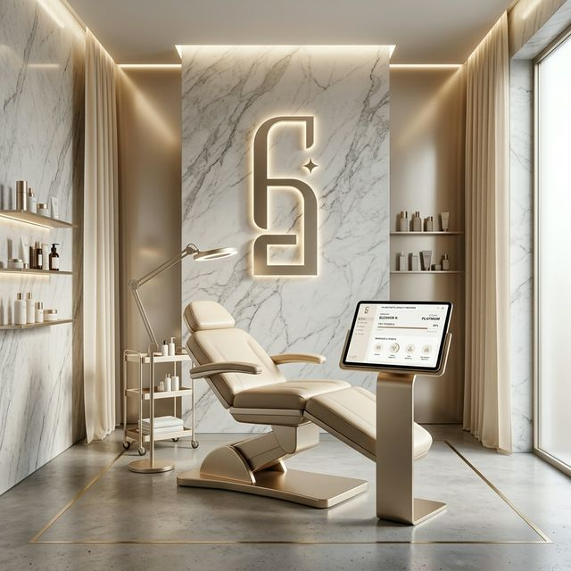

  
  
  # ✨ FG Aesthetic NFC Loyalty System ✨
  
  *Elevating Beauty Clinic Management with Seamless Intelligence*
  
  
  
  

  ---

## 💎 The Vision

FG Aesthetic is a sophisticated, full-stack ecosystem designed specifically for high-end beauty clinics. It bridges the gap between hardware and software, integrating **NFC technology** to provide an unparalleled check-in experience while streamlining complex clinic operations.

---

## 🚀 Key Capabilities

### 🎫 Hardware-Level Intelligence
- **NFC Seamless Integration** – Tap-to-identify using USB HID readers for instant profile retrieval.
- **Smart Registration** – Automated detection of new cards with immediate provisioning.

### 👥 Precision Client Care
- **Holistic Profiles** – Track skin types, allergies, emergency contacts, and detailed point histories.
- **Loyalty Engine** – Automated point accrual and redemption system balanced with manual audit controls.

### 📅 Advanced Clinic Orchestration
- **Intuitive Calendar** – Segmented scheduling with support for multiple branches and staff filters.
- **Treatment Tracking** – Maintain granular logs of session-based treatments and remaining counts.
- **Operational Analytics** – Dynamic daily, weekly, and monthly reports for sales and staff performance.

### 🏥 Branch & Asset Management
- **Role-Based Governance** – Super Admin, Branch Admin, and Staff tiers with strict data isolation.
- **Equipment Health** – Track the operational status of specialized clinic equipment.
- **Inventory Control** – Monitor consumable levels to ensure continuous service availability.

---

## 🛠️ The Architecture

| Layer | Technology |
| :--- | :--- |
| **Frontend** | React 19 • TypeScript • Vite 7 • Tailwind CSS 4 • Shaden/ui |
| **Backend** | Python 3 • Flask • Supabase Python SDK |
| **Database** | PostgreSQL • Row Level Security (RLS) |
| **Auth** | Supabase Auth (JWT & Managed Sessions) |
| **Hardware** | Any USB HID-Mode NFC Reader (Keyboard Emulation) |

---

## 💳 NFC Hardware Workflow

The system is optimized for **zero-click identification**:

1. **Tap:** Client taps their loyalty card on the reader.
2. **Identification:** The system traps the HID signal and queries the profile in real-time.
3. **Action:** Dashboard automatically updates to reflect the client's current status, remaining treatments, and loyalty balance.

---

## 📜 License

Distributed under the **MIT License**. Created by [FG Aesthetic Team].

---

  Built for performance, designed for beauty.

